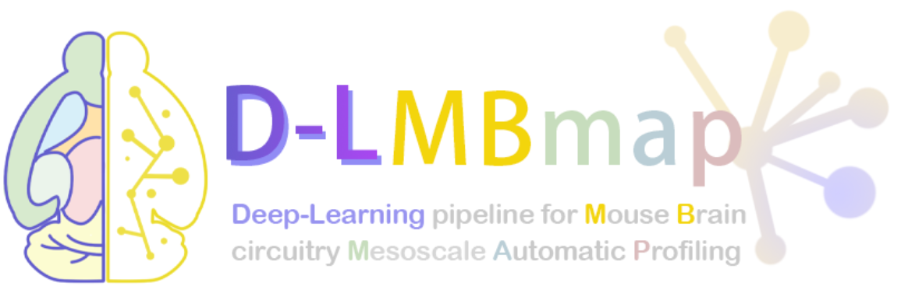

# D-LMBmap

## D-LMBmap software
D-LMBmap provides an open-source software with convenient high-level application programming interfaces (APIs) that can be used to build applications and extensions. The GUI provides functionality for the selection and computation of different pre-trained deep models. 
You can use D-LMBmap software by run the python code or download our software from github->release.
