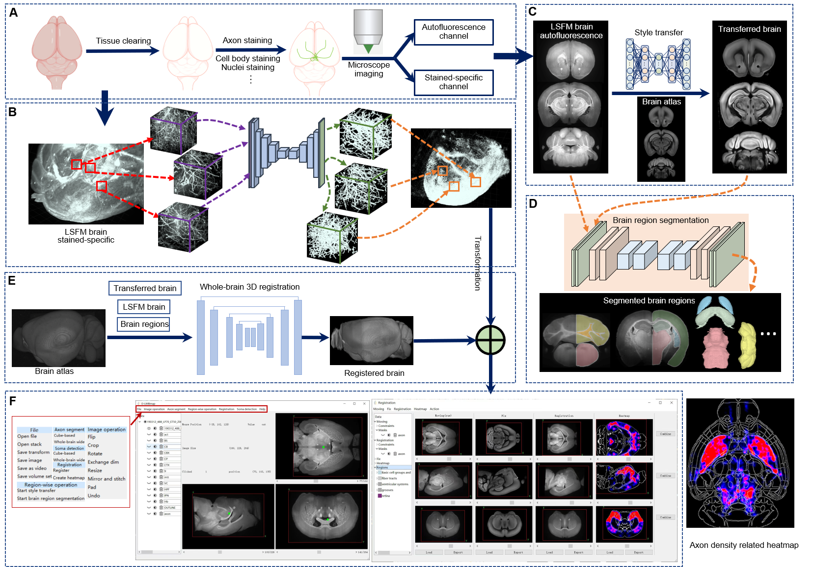

# D-LMBmap

## Overview
D-LMBmap, an end-to-end package providing an integrated workflow containing three modules based on novel deep-learning algorithms for whole-brain connectivity mapping: axon segmentation, brain region segmentation and whole-brain registration. D-LMBmap is the first method that does not require manual annotation for axon segmentation, and achieves quantitative analysis of whole-brain projectome in a single workflow with superior accuracy for multiple cell types in all of the modalities tested.

Our pre-trained models and test dataset are accessible [here](https://drive.google.com/drive/folders/1wQ-gvxpLPXUk6D-2jdbttq_lOw1nzBzz?usp=share_link).

## D-LMBmap software
[D-LMBmap](https://github.com/lmbneuron/D-LMBmap/releases)

D-LMBmap provides an open-source software with convenient high-level application programming interfaces (APIs) that can be used to build applications and extensions. The GUI provides functionality for the selection and computation of different pre-trained deep models. 
You can use D-LMBmap software by run the python code or download our software from github->[release](https://github.com/lmbneuron/D-LMBmap/releases/tag/v1.0.0).

Please refer to the [tutorial](https://github.com/lmbneuron/D-LMBmap/tree/main/tutorial) before using the software. Our pre-trained models for the software are accessible [here](https://drive.google.com/drive/folders/1wQ-gvxpLPXUk6D-2jdbttq_lOw1nzBzz?usp=share_link).

## Axon Segmentation

We provide a whole-brain axon segmentation pipeline and model training method, which can be accessed [here]([https://github.com/lmbneuron/D-LMBmap/tree/main/Axon%20Segmentation](https://drive.google.com/drive/folders/1lEg_epSqCMjSUmVAdwwStvobXrEt82gq?usp=share_link).

Because the whole brain segmentation takes a certain amount of time, we will optimize the module and integrate it into the software in the future. At present, some small volumes can be segmented.

## Brain Region Segmentation & Brain Style Transfer

Brain region segmentation and brain style transfer methods mainly serve for whole brain registration. We also provide model training and prediction methods respectively, please refer to [Brain region segmentation](https://github.com/lmbneuron/D-LMBmap/tree/main/Brain%20Region%20Segmentation) and [Brain style transfer](https://github.com/lmbneuron/D-LMBmap/tree/main/Brain%20Style%20Transfer).

Some models have been integrated into D-LMBmap software.

## License
This work is licensed under a Creative Commons Attribution 4.0 International License
