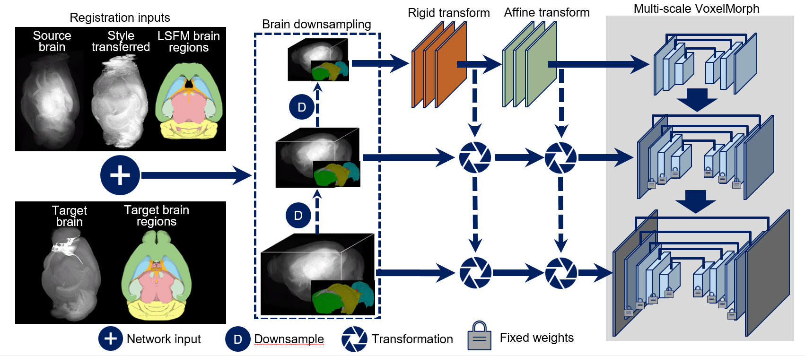

D-LMBMap
========

Architecture
------


Tutorial
-------
>Training
>```
>
>example: python main.py --train -c config.yaml -o ckp/test2
>necessary parameter: 
>--train: config the network into training mode
>-c/--config: appoint the config(.yaml) file which contains the training settings
>optional parameter:
>-o/--output: select the folder where training result will be save at
>```

>Evaluate
>```
>example: python main.py --eval --config config.yaml --checkpoint "/media/data1/zht/Recursive_network_pytorch/ckp/soma_data_4/checkpoint/2999.pth" --output result/soma_data_4
>
>necessary parameter:
>--eval: config the network into evaluate mode
>--checkpoint: select the checkpoint(.pth) file using in evaluation
>-c/--config: appoint the config(.yaml) file which contains the evaluate settings, normally it shall be the same as training config corresponding to the checkpoint file
>
>optional parameter:
>-o/--output: select the folder where training result will be save at
>```

>Register
>```
>example: python main.py --test -c config.yaml --checkpoint "" --test_config test_config.yaml -o result/test
>
>necessary parameter:
>--test: config the network into register mode
>--checkpoint:select the checkpoint(.pth) file using in registration
>-c/--config:appoint the config(.yaml) file which contains the evaluate settings, normally it shall be the same as training config corresponding to the checkpoint file
>--test_config:appoint the config(.yaml) file which contains the information of origin size image
>
>optional parameter:
>-o/--output:select the folder where training result will be save at
>```


>Average
>```
>example: python main.py --ave -c configs/bezier_atlas_2.yaml --checkpoint "/media/root/01a3fb01-7912-492d-9561-d36a4da2ffef/zht/data/MS-RegNet/ckp/bezier_atlas_data2_new/checkpoint/6199.pth"  -o result/bezier_atlas_new2
>
>necessary parameter:
>--ave: config the network into average mode
>--checkpoint: select the checkpoint(.pth) file using in average
>-c/--config:appoint the config(.yaml) file which contains the evaluate settings, normally it shall be the same as training config corresponding to the checkpoint file
>
>optional parameter:
>-o/--output:select the folder where training result will be save at
>```
