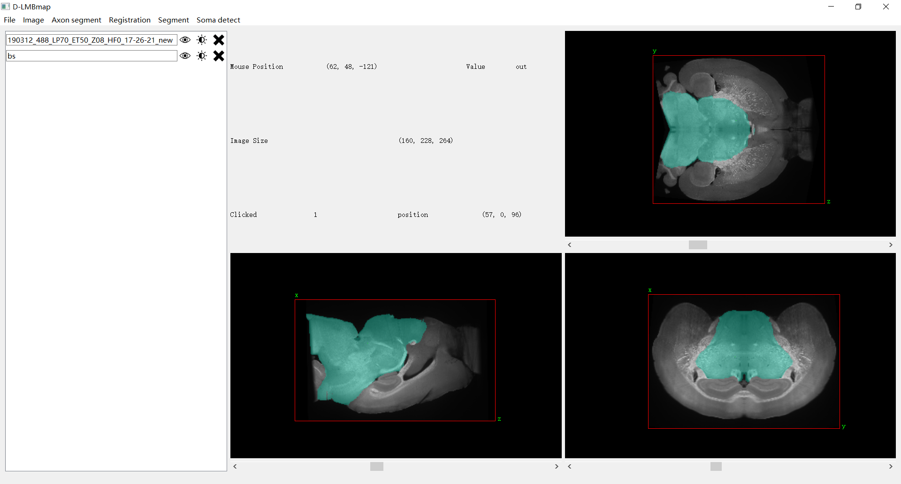
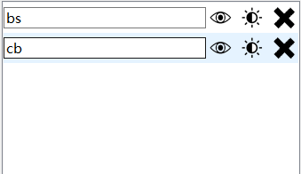
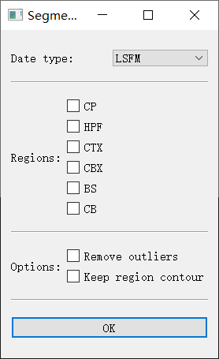
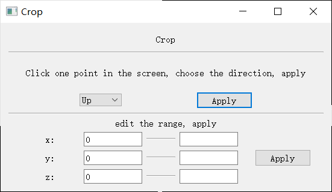
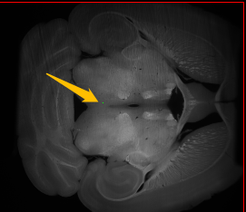
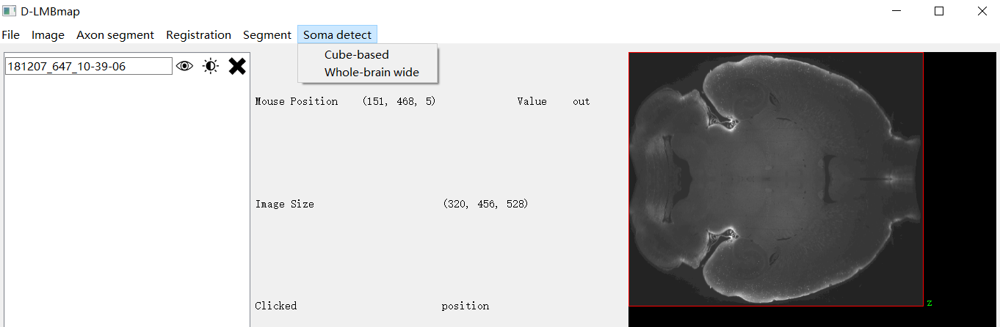
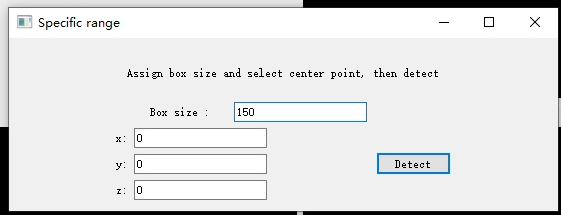
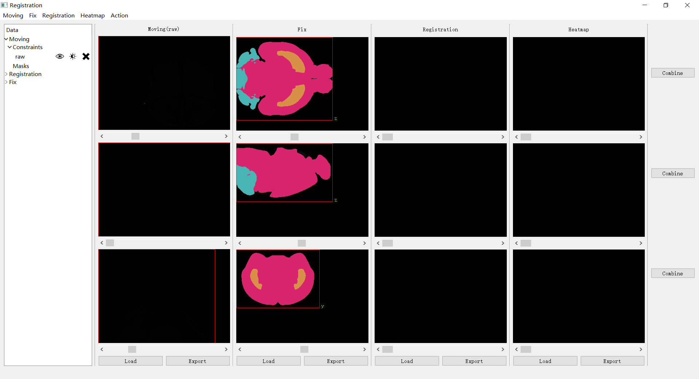
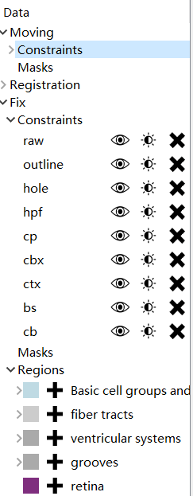
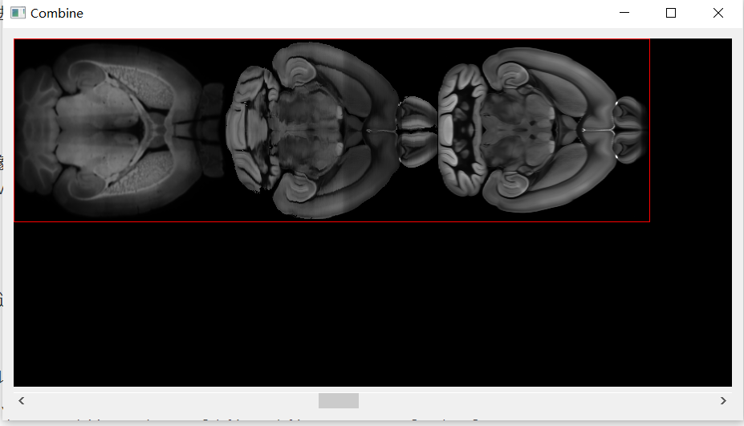

# D-LMBmap software

## Documentation
Our software consists of two interfaces, one is main inteface and the other one is registration inteface.

### Main inteface

#### 1. The whole inteface

The whole inteface is shown below. The data used in Register, Region segment, Style transfer, Soma detect needs to be in the same direction as the following figure. You can use actions in the Action menu to adjust the direction and size.

#### 2. Import
There are two types to read the data.

* The data can be read by draging the file to the window. The are two types of files that can be read, one is a single file(including tiff, tif, nii, mhd format), the other is the entire folder, which are named in sequence tiff file.

* Or click File->OpenFile or File->OpenStack. OpenFile means opening a single file, and OpenStack opening a folder.

* If you open a single file, you don't need to set the Compress size. You need to choose to load this file MainImage, Segmentation or heatmap, where MainImage represents the main image, and Segmentation is a mask image, representing the label value of one or more areas (can be obtained by segmentation of brain regions). **All images need to be a size of (x, y, z), uint16 or uint8, color images are not supported**. The shape of heatmap is (x, y, z, 3), which is an RGB image (which can be obtained through the registration interface Action->create heatmap).
  If you open a folder, the default setting is MainImage.
  The difference of these three types of images is that when MainImage is displayed, the corresponding data is directly displayed, while when Segmentation is displayed, the corresponding rgb is selected to display as a color map according to the corresponding voxel value, and heatmap is to display an RGB color map. All images in the main interface (including MainImage and Segmentation, Heatmap) should have the same size. There is no way to display images of (100, 100, 100) and (200, 200, 200) together.
  
  
* If you open a folder, you need to compress it (i.e. set Compress size). For one single file, the data is read as the original size because of one file cannot be too big. But for folders, you need to select the compressed size. The Compress size is calculated by dividing compressed image size by original image size (1 represents the original size), so it should be a number less than 1. (If it is a 20G folder, just choose 0.1 0.2. It will get stuck if the Compress size is too big).

#### 3. Export

including SaveTransform, SaveImage and Save as Video.

* Save Transform: This is to export the transformation operations other than color adjustment in 7 for the image. The transform can be used by re_big_brain.py. The default extension is yaml.

* Save Image: This is to export the transformed image. The brightness and contrast will not be considered, and the brightness of the original image will be maintained. (**Only MainImage is exported here, and segmentation will not be exported**)

* Save as Video: This is to directly export one of the three perspectives into a video. You can select FPS. The video exported here is basically the same as what you see in the software.
  
  

  

#### 4. Operation in the inteface

* For the read file, the entire image area will be surrounded by a red frame, and the outside of the red frame will be out of bounds. At the same time, the coordinate axis will be set in each interface, which is convenient for operations in 7.

* Click any of the three small windows to drag the image in the small window; click once to end the drag. Clicking the right mouse button will reset.

* Sliding the mouse wheel in one direction zooms in on the image from your mouse's point of view, and zooms out in the other direction. Clicking the right mouse button will reset.

* The window will display the current mouse position, as well as the image size, and which point of view you clicked with the mouse.

* For imported images, a line will be added to the name column to represent the corresponding image. The line of information from left to right is: the name of the image (which can be directly modified), whether to hide, adjust the color (the brightness and contrast can be adjusted for the MainImage, and the transparency can be adjusted for the Segmentation), and delete.

#### 5. Region segment

  For the region segmentation function, it will be a bit slower when it is used for the first time because it needs to download the model from google drive.

1. Click Segment->Start segmentation.

2. Select the modal of your data：such as LSFM, MRI。 
3. Select the brain regions you want to segment. 
4. Some other options: check whether to remove the outliers in the segmentation, whether to enable the contour segmentation mode.
5. After the selection, click the OK button to start region segmentation. It may take a long time to run the model, please be patient.

* The color of the segmented region is automatically generated, and the result can be found in the name column on the left.

#### 6. Style transfer
  For the style transfer function, it will be a bit slower when it is used for the first time because it needs to download the model from google drive. It can be performed on the main interface or on the registration inteface.

Style transfer on the main inteface.
* First you need to import a Main Image。 
* Click Segment->Start style transfer.
* Select the modal, such as Adipo-Clear, iDISCO, MRI.
* Click the OK button and start to do the style transfer. The result will replace the current Main Image。

Style transfer on the registration inteface.
* First, import a Main Image when "Moving (raw)" is displayed on the header in the Moving window. 
* Click Action->Transfer in the menu.
* Select the modal, such as Adipo-Clear, iDISCO, MRI.
* Click the OK button and start to do the style transfer. The obtained result will be displayed in the Moving window, and "Moving(transfer)" will be displayed on the header. Click Moving(raw) or Moving(transfer) to switch.
  

#### 7. Some operations of the images：

This operations are under the Image menu.

* Crop：There are two ways of cropping, which are divided by horizontal lines. 
  The upper one is: firstly, you need to click in any of the three perspectives, then a blue-green point (smaller, please observe carefully) will appear in the corresponding position. Then choose whether to crop to remove the left, right, top, or bottom area of the point.
  The way of the lower one is: directly give the range of x y z to keep.
  
The crop window:

* Mirror: Select the axis to be mirrored (x, y, z) to mirror the corresponding axis.
* Rotate: First, you also need to click a point in an of the three perspectives as the rotation center, and then give the corresponding angle. A positive number means clockwise rotation, and a negative number means counterclockwise rotation. 360° is a rotation period instead of 2pai.
* Exchange dim: Select two axes to swap.
* Resize: Directly specify the x y z you want to get and change the image to the size you want.
* Mirror and stitch: First mirror the current image along a certain axis, and then stitch the current image and the mirrored image according to the axis.
* Pad: Directly specify the length to be zero-padding on the left and right sides of each axis of the x, y, and z axes. An application scenario is that there may be a situation of turning out when rotating, and zero-padding can prevent this from happening.

All the above operations can be undone with ctrl+z.

#### 8.Soma detect
Click Soma detect in the main menu after loading the image to be detected in the main interface.

Whole-brain wide: The option is to detect in the current whole brain.
Cube-based: This option provides a method for selecting a cube for detection, the initial value of which is box size: 150 and x, y, z coordinates of the green point on the main screen.

#### 9.Axon segment
For the axon segmentation, it will be a bit slower when it is used for the first time because it needs to download the model from google drive. 

Click the Axon segment in the main menu after loading the image to be detected in the main interface.
* Whole-brain wide(TODO)
* Cube-based: It is required that the image to be detected is a cube cropped from the original image, and the corresponding result can be obtained by clicking directly.

### Registration inteface

Click the Registration->Register in the main interface and jump to the registration inteface.

It will be a bit slower when it is used for the first time because it needs to download the model from google drive.

The registration interface is shown as follows.

On the left is the name column, which represent the Moving Fix Registration images.

The middle window contains the Moving image, Fix image, Registration image and Heatmap image from left to right.

Each image has three views of x y z so there are 12 small windows in total. Now the image size is required to be (160, 228, 264), and then the software will modify it.

#### 1. Name column
Each of these three types (Fix, Moving, Registration) contains two categories of images: Constraints and Masks, where Constraints are the brain regions needed for registration, and now include six brain regions of CP, HPF, CTX, CBX, CB, BS and OUTLINE.
Masks represents the Mask image except Constraints.

For each line in Constraints and Masks, from left to right is the name, whether to hide, color, and whether to delete.

The Fix image also contains a column for Regions, which contains all the names of Allen's brain regions, and is listed according to the hierarchical inclusion relationship. Each line is: color, added to Fix's Masks, and name.

#### 2. Moving window
There are three windows in this part of the Moving image. Click upload to upload or directly drag it into this position to upload.

Click Moving(raw) or Moving(transfer) to upload the original image or the transferred image respectively. You can also click Action->Transfer to transfer the Moving(raw) data to obtain Moving(transfer).

Click Action->Register and register the Fix image and the Moving image. The result will be shown in the Registration image window.

The following actions can be taken for Moving images in the menu bar. 
- Moving->File: including import and export. The import action includes Moving->File-> Import-> From File which means import from file and Moving->File-> Import -> From main inteface which means obtained by copying the image in the main interfacfe.
  The usage of the Export is similar with the Import.

#### 3. Fix image

There is no button for the Fix image, because this belongs to the allen image and does not support manual load and import.

#### 4. Registration image

You can upload it, or you can directly drag it into this location to upload it, or you can get it by clicking Action->Register through Fix image and Moving image.

#### 5. Heatmap image

For the Segmentation obtained in the Registration image (such as the soma mask obtained by soma detection and the axon mask obtained by the axon segmentation), you can click Action->Create heatmap and select the mask image with the corresponding name. A Heatmap image will be generated.

For the combine button on the right side of the inteface, you can view the displayed images by splicing them together in order. File->Export Video supports video export.

## Computation Cost
We test reigstration, soma detection, axon segmentation, style transfer and brain region segmentation on the CPU and GPU. The time is shown below. (Soma detection can only run on the CPU.)

|Function\Time|  CPU   | GPU  |
|---- |  ----  | ----  |
|registration | 4m  | 19s |
|soma detection | 20s |
|axon segmentation | 17s | 5s |
|brain region segmentation | 5m | 1m 40s |
|style transfer| 11m | 6m 30s |

CPU:  Intel(R) Core(TM) i5-9500; GPU: NVIDIA GeForce RTX 3060Ti
## Package
Use the pyinstaller to package the whole project, and a dist folder will be generated in the current directory, which is the packaged software.

Before packaging with pyinstaller, you need to modify some parameters in the main.spec:

* Add some terms in the hidden import, such as 'pkg_resources.py2_warn', 'pkg_resources.markers'

* Add more paths, such as : ...../anaconda3/envs/……/Lib/site-packages/torch/lib, ..../anaconda3/envs/……/Library/bin (where the ellipsis should be  replaced by the real directory).

* Add more data terms, such as ('.../anaconda3/envs/……/Library/bin/nvrtc64_111_0.dll', '.'), ('core/register/configs', 'core/register/configs'), ('core/register/ckp', 'core/register/ckp'), ('myresource', 'myresource')
