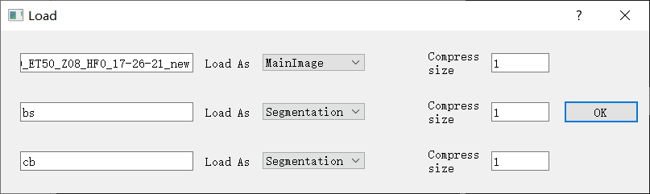
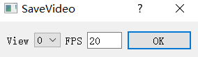

# D-LMBmap software

We provide a [tutorial movie](https://github.com/lmbneuron/D-LMBmap/blob/main/tutorial/tutorial_video.mp4) with detailed instructions for using the D-LMBmap software. Users can follow the movie as a guide to achieve each module in whole brain projection mapping. 

## Documentation
Our software consists of two interfaces, one is main inteface and the other one is registration inteface.

### 1. Import
You can import the file by the following actions. 

* The data can be read by draging the file to the window. The are two types of files that can be read, one is a single file(including tiff, tif, nii, mhd format), the other is the entire folder, which are named in sequence tiff file.

* Or click File->OpenFile or File->OpenStack. OpenFile means opening a single file, and OpenStack opening a folder.

* If you open a single file, you don't need to set the Compress size. You need to choose to load this file MainImage, Segmentation or heatmap, where MainImage represents the main image, and Segmentation is a mask image, representing the label value of one or more areas (can be obtained by segmentation of brain regions). **All images need to be a size of (x, y, z), uint16 or uint8, color images are not supported**. The shape of heatmap is (x, y, z, 3), which is an RGB image (which can be obtained through the registration interface Action->create heatmap).
  If you open a folder, the default setting is MainImage.
  The difference of these three types of images is that when MainImage is displayed, the corresponding data is directly displayed, while when Segmentation is displayed, the corresponding rgb is selected to display as a color map according to the corresponding voxel value, and heatmap is to display an RGB color map. All images in the main interface (including MainImage and Segmentation, Heatmap) should have the same size. There is no way to display images of (100, 100, 100) and (200, 200, 200) together.
  
  
* If you open a folder, you need to compress it (i.e. set Compress size). For one single file, the data is read as the original size because of one file cannot be too big. But for folders, you need to select the compressed size. The Compress size is calculated by dividing compressed image size by original image size (1 represents the original size), so it should be a number less than 1. (If it is a 20G folder, just choose 0.1 0.2. It will get stuck if the Compress size is too big).
-------
### 2. Image operation
After importing the files (e.g. Click File->Open file and choose the examples/190312_488_LP70_ET50_Z08_HF0_17-26-21.tiff), you can do some image operations.
* **Mirror**. Mirrored brain based on the assigned normal
plane
* **Crop**. Click one point (in green) and choose cropped direction (Up, Down, Left, Right). Or Edit the range of cropped brain (keep the
brain in the input range).
* **Rotate**. Click one point (in green) as the rotation center, then rotate brain based on assigned angle and the clicked plane (-360 to 360)
* **Exchange dim**. Change viewpoints with assigned direction by select two dimensions.
* **Resize**. Resized brain data with assigned resolution.
* **Mirror and stitch**. Mirror half brain and stitch with assigned plane.
* **Brightness/Contrast**. Click the "sun" icon on the left panel.
* **Hide image channels**. Click the "eye" icon on the left panel.
* **Delete image channels**. Click the "cross" icon on the left panel.
* **Rename file names**. Directly input the new file name on the left panel.
All the above operations can be undone with ctrl+z.
-------
### 3. Axon segmentation
1. Import data (an axon stained cube or an axon stained whole brain data, e.g. examples/test_axons_segmentation/cropped-volume147.tif)

2. Click Axon segmentation -> Segment by axon types -> Select an axon type -> OK

3. Get segmented axons.

4. Computational cost for reference

   | Volume size     | CPU time | Memory Usage | GPU time | Graphics Memory usage |
   | --------------- | -------- | ------------ | -------- | --------------------- |
   | (150, 150, 150) | 4m       |              | 19s      |                       |
   | (600, 600, 450) | 20s      |              |          |                       |
   | Whole Brain     | 17s      |              | 5s       |                       |

   Test Environment

   CPU: Intel(R) Core(TM) i5-1135G7

   GPU: NVIDIA GeForce RTX 4090
-------
### 4. Style transfer
1. Import data (brain data in 488 channel, e.g. examples/190312_488_LP70_ET50_Z08_HF0_17-26-21.tiff)
2. Click Region-wise operation->Start style transfer.
3. Select source data type (Adipo-clear) and target data type (Allen atlas).
4. Get style transferred brain (need about 6 minutes).
-------
### 5. Brain region segmentation
1. Import data (brain data in 488 channel, e.g. examples/190312_488_LP70_ET50_Z08_HF0_17-26-21.tiff)
2. Click Region-wise operation->Start segmentation.
3. Select brain regions need to be segmented, including brain outline, major brain regions (CP, HPF, CTX, CB, CBX, BS), small brain regions (IPN, act, Hb, mtt, fr).
-------
### 6. Soma detection
**Cube-based soma detection**
1. Import data (brain data in 488 channel, e.g. examples/190312_488_LP70_ET50_Z08_HF0_17-26-21.tiff).
2. Click Soma detection->Cube based.
3. assign cube size and the location of cube center.
4. Click "detect".
5. Get detected some in assigned cubes.

**Whole-brain wide soma detection**
1. Import data (brain data in 488 channel, e.g. examples/190312_488_LP70_ET50_Z08_HF0_17-26-21.tiff)
2. Click Soma detection->Whole brain wide.
3. Get detected some in whole brain.
-------
### 7. Registration
1. Import data(brain data in 488 channel, e.g. examples/190312_ 488_LP70_ET50_Z08_HF0_17-26-21.vset)
2. Click Registration and turn to the Registation Interface.
3. Click "Moving" on top left-->File-->Import-->From main interface
4. Click "Moving (raw)" in the registration panel-->Showing "Moving (transfer)"-->Click "Moving" on top left-->Fike-->Import-->From file-->Upload a style transferred brain(examples/transferred.tiff)
5. Optionally, users can also upload multiple brain regions as constraints (in the "Moving (raw)" panel)
6. Optionally, Users can also upload a whole-brain segmented axon file.
7. Click "Action"-->Register.
8. Select brain regions for constrain.
9. Obtain registerred brain (in column-3 -->Registration) (about 3 minutes).

After registration, the following actions can be done.\
**Create heatmap**
1. Click "Action"-->Creat heatmap.
2. Select one mask (e.g. axon).
3. Obtain heatmap with axon density in hundreds of brain regions.

**Visualize hundred of brain regions**
1. On the left panel of Registration-->"Regions".
2. Right Click interested brain regions.
3. Add to Fix brain. Add to Registration brain. Add to heatmap.

**Combine visualization**
1. Click Combine.
2. Visualize and compare Moving brain, Fix brain, Registratiojn brain, heatmap brain slice by-slice
-------
### 8. Export

including SaveTransform, SaveImage and Save as Video.

* Save Transform: This is to export the transformation operations other than color adjustment in 7 for the image. The transform can be used by re_big_brain.py. The default extension is yaml.

* Save Image: This is to export the transformed image. The brightness and contrast will not be considered, and the brightness of the original image will be maintained. (**Only MainImage is exported here, and segmentation will not be exported**)

* Save as Video: This is to directly export one of the three perspectives into a video. You can select FPS. The video exported here is basically the same as what you see in the software.
  
  
-------
## Computation Cost
We test reigstration, soma detection, axon segmentation, style transfer and brain region segmentation on the CPU and GPU. The time is shown below. (Soma detection can only run on the CPU)

|Function\Time|  CPU   | GPU  |
|---- |  ----  | ----  |
|registration | 4m  | 19s |
|soma detection | 20s |
|axon segmentation | 17s | 5s |
|brain region segmentation | 5m | 1m 40s |
|style transfer| 11m | 6m 30s |

CPU:  Intel(R) Core(TM) i5-9500; GPU: NVIDIA GeForce RTX 3060Ti
